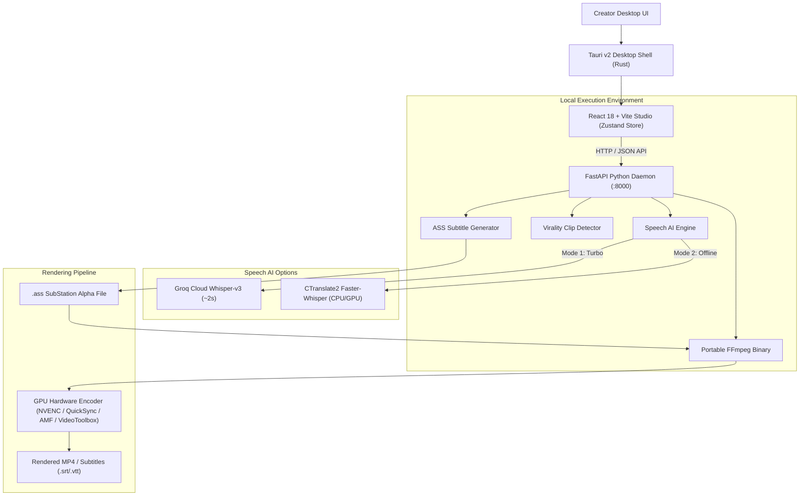

# ⚡ CapShorts — Complete Architecture & Developer Documentation

> **The 100% Free, Local-First AI Video Editor for Short-Form Content Creators.**  
> Native desktop suite for generating word-accurate animated captions, extracting viral 9:16 shorts, removing dead air, and rendering studio-grade videos with zero subscriptions, zero watermarks, and zero third-party cloud lock-in.

---

## 📑 Table of Contents
1. [Overview & Core Philosophy](#1-overview--core-philosophy)
2. [High-Level Architecture](#2-high-level-architecture)
3. [Technology Stack](#3-technology-stack)
4. [Installation & Getting Started](#4-installation--getting-started)
5. [Core Features & User Guide](#5-core-features--user-guide)
   - [Media Import](#51-media-import)
   - [Speech-to-Text Transcription](#52-speech-to-text-transcription)
   - [Urdu & Multi-Language Transliteration](#53-urdu--multi-language-transliteration)
   - [AI Viral Shorts Detection](#54-ai-viral-shorts-detection)
   - [Animated Subtitle Presets & Styling](#55-animated-subtitle-presets--styling)
   - [Multi-Track Timeline & Canvas Monitor](#56-multi-track-timeline--canvas-monitor)
   - [Video & Subtitle Export](#57-video--subtitle-export)
6. [Backend API Reference](#6-backend-api-reference)
7. [Hardware Acceleration & Encoding](#7-hardware-acceleration--encoding)
8. [Privacy, Security & Telemetry](#8-privacy-security--telemetry)
9. [Keyboard Shortcuts](#9-keyboard-shortcuts)
10. [Troubleshooting & FAQs](#10-troubleshooting--faqs)

---

## 1. Overview & Core Philosophy

Short-form video platforms (TikTok, YouTube Shorts, Instagram Reels) require high-energy, word-accurate animated subtitles and rapid hook extraction. Existing cloud solutions (Opus Clip, Submagic, CapCut Pro) suffer from:
- **High Recurring Costs:** \$20–\$50 per month subscriptions.
- **Privacy Intrusion:** Uploading gigabytes of private drafts and confidential videos to third-party cloud servers.
- **Queue Latency:** Long upload and rendering waiting times.
- **Arbitrary Limitations:** Monthly credit caps and forced watermarks on free plans.

**CapShorts solves this with a local-first desktop philosophy:**
- **Zero Cost & Open Source:** Licensed under MIT for unlimited personal and commercial use.
- **Instant Speed:** 2–3 second transcription via intelligent Groq Cloud Turbo rotation, with full offline on-device CPU/GPU fallback (CTranslate2 Faster-Whisper).
- **Zero Watermarks:** Uncompressed studio export up to 60 FPS in 9:16, 16:9, or 1:1.
- **Privacy Respecting:** All video rendering and audio cutting happens directly on your machine.

---

## 2. High-Level Architecture

CapShorts uses a modular architecture combining a high-performance **Rust desktop shell (Tauri v2)**, a reactive **React 18 frontend**, an asynchronous **Python 3.11 AI daemon (FastAPI)**, and a **portable FFmpeg media pipeline**.



---

## 3. Technology Stack

| Layer | Technologies | Purpose |
| :--- | :--- | :--- |
| **Desktop Shell** | Tauri v2 (Rust) | Native window management, low memory footprint (<80MB RAM), native file dialogs |
| **Frontend** | React 18, TypeScript, Vite, Tailwind CSS | 60 FPS Canvas playback, real-time subtitle preview, multi-track timeline |
| **State Management** | Zustand (with shallow diffing) | Global store for playhead, timeline segments, words, and clips |
| **Icons & Design** | Lucide React, Plus Jakarta Sans, Inter | Obsidian studio aesthetic, Apple/CapCut-grade controls |
| **AI Daemon** | Python 3.11, FastAPI, Uvicorn, PyInstaller | REST API running locally on port `8000`, compiled as standalone binary |
| **Speech-to-Text** | Faster-Whisper, Groq Cloud API, CTranslate2 | Word-level timestamps, automated punctuation, multi-language speech AI |
| **Transliteration** | Python custom mapping dictionary | Instant transliteration from Urdu script / Arabic to Roman Urdu |
| **Media Processing** | Portable FFmpeg & FFprobe (GPL v3) | Hardware-accelerated ASS subtitle burning, dynamic scaling, B-roll composites |

---

## 4. Installation & Getting Started

### Pre-Packaged Native Installers (Recommended)
Pre-built binaries bundle Python, FFmpeg, and the AI engine with **zero system dependencies**:

- **Windows:** Download `CapShorts_1.1.4_x64-setup.exe` (or enterprise `.msi`) from [GitHub Releases](https://github.com/thealiraza2/CapShorts/releases/latest).
- **macOS:** Download `CapShorts_1.1.4_universal.dmg` (supports Apple Silicon M1/M2/M3/M4 & Intel Macs).

### Building From Source (Local Development)

#### Prerequisites
- **Node.js:** v20.x or v22.x
- **Python:** 3.10 or 3.11
- **Rust & Cargo:** Stable toolchain (`rustup default stable`)
- **FFmpeg:** Accessible in PATH or placed in `CapShorts/src-tauri/binaries/bin/`

#### 1. Clone Repository
```bash
git clone https://github.com/thealiraza2/CapShorts.git
cd CapShorts
```

#### 2. Start Backend Engine
```bash
cd CapShorts/backend
python -m venv venv

# Windows:
.\venv\Scripts\activate
# macOS / Linux:
source venv/bin/activate

pip install -r requirements.txt
python engine.py
```
*The FastAPI backend will start on `http://127.0.0.1:8000`.*

#### 3. Start Frontend Studio
```bash
cd ../frontend
npm install
npm run dev
```
*The studio will be available at `http://localhost:5173`.*

#### 4. Run Desktop App via Tauri
```bash
cd ../src-tauri
cargo tauri dev
```

---

## 5. Core Features & User Guide

### 5.1 Media Import
- Supported video containers: **MP4, MOV, ProRes, WebM, MKV, AVI**.
- Drag and drop any video directly into the Canvas Monitor or use the **Import Video File** button in the Media Library.
- CapShorts instantly inspects container metadata, dimensions, framerate, and audio sample rate via FFprobe.

### 5.2 Speech-to-Text Transcription
CapShorts offers two transcription engines:
1. **Ultra Fast Cloud AI (Groq Whisper-Large-v3 Turbo):**
   - Transcribes a 10-minute video in **~2 to 3 seconds**.
   - Rotates through a pool of Groq API keys automatically.
   - Users can provide their own free key in **Settings (`⌘,` or `Ctrl+,`) → AI Models**.
2. **Standard Offline On-Device (Faster-Whisper):**
   - Runs 100% locally on your CPU or NVIDIA GPU using CTranslate2.
   - Zero internet connection required; completely private.

### 5.3 Urdu & Multi-Language Transliteration
- Supports 90+ spoken languages (English, Urdu, Hindi, Spanish, Arabic, German, French, etc.).
- Includes a built-in Urdu-to-Roman transliteration engine: converts Nastaliq / Arabic script into clean, readable Roman Urdu keywords popular in South Asian TikTok/Reels content.

### 5.4 AI Viral Shorts Detection
- Emulates the **Opus Clip** viral extraction model.
- Automatically analyzes sentence pace, question hooks, excitement keywords, and semantic density.
- Highlights top clips with a **Virality Score (0–100%)**, recommended start/end timestamps, and hook summaries.
- Clicking any detected clip automatically crops the canvas to 9:16 and sets the timeline playhead to the short.

### 5.5 Animated Subtitle Presets & Styling
Comes bundled with viral creator typography presets:
- **MrBeast Pop:** High-contrast yellow pop highlights with black borders.
- **Alex Hormozi:** Bold uppercase typography with neon green / yellow accents.
- **Cyberpunk Neon:** Glowing cyan and magenta stroke effects for tech/gaming.
- **Karaoke Sweep:** Word-by-word wipe animation matching spoken timing.
- **Custom Overrides:** Real-time font family, font size, stroke width, text casing, shadow depth, and position adjustment in the Properties Inspector.

### 5.6 Multi-Track Timeline & Canvas Monitor
- **Interactive Playhead:** Non-blocking hardware-accelerated seeking.
- **Blade Cut Tool (`B`):** Split video segments anywhere on the playhead.
- **Selection Tool (`V`):** Move and adjust segment boundaries.
- **Delete (`Del` or `Backspace`):** Remove unwanted dead air or filler words.
- **TikTok / Reels Safe Guides:** Toggle safe margin overlays to prevent UI icons from obscuring subtitles.

### 5.7 Video & Subtitle Export
- **Video Export:** Burns styled Advanced SubStation Alpha (`.ass`) subtitles directly into the video stream using hardware GPU encoding.
- **Aspect Ratios:** 9:16 Vertical Short (1080x1920), 16:9 Landscape (1920x1080), 1:1 Square (1080x1080).
- **Subtitles Only:** 1-Click download of standalone **`.SRT`** or **`.VTT`** subtitle files for direct upload to YouTube Studio or Premiere Pro.

---

## 6. Backend API Reference

The local Python engine exposes the following REST endpoints on `http://127.0.0.1:8000`:

### `POST /api/transcribe`
Uploads a video and begins background speech recognition.
- **Content-Type:** `multipart/form-data`
- **Parameters:**
  - `file`: Video binary stream.
  - `model`: Model name (`whisper-large-v3-turbo` or `base`).
  - `language`: Target language code (e.g., `auto`, `en`, `ur`, `hi`).
  - `groq_api_key`: Optional user Groq API key.
- **Response:**
  ```json
  {
    "status": "started",
    "task_id": "a1b2c3d4",
    "video_path": "/path/to/cached/input.mp4"
  }
  ```

### `GET /api/transcribe/progress/{task_id}`
Polls transcription progress percentage and retrieved tokens.
- **Response (in progress):**
  ```json
  {
    "progress": 55,
    "step": "Transcribing speech: 01:20 / 03:00 (55%)...",
    "status": "processing"
  }
  ```
- **Response (completed):**
  ```json
  {
    "progress": 100,
    "status": "completed",
    "words": [
      { "id": "w1", "start": 0.3, "end": 0.8, "word": "Unlock", "keyword": false }
    ],
    "clips": [...],
    "duration": 180.5,
    "video_path": "/path/to/cached/input.mp4"
  }
  ```

### `POST /api/export`
Queues a hardware-accelerated video render.
- **Payload:**
  ```json
  {
    "video_path": "/path/to/video.mp4",
    "transcript": [...],
    "preset": { "id": "mrbeast-yellow-pop", "fontSize": 64, ... },
    "resolution": "1080x1920",
    "aspect_ratio": "9:16",
    "clip_start": 0.0,
    "clip_end": 45.0,
    "output_filename": "viral_short.mp4"
  }
  ```
- **Response:** `{"status": "queued", "task_id": "exp_7890"}`

### `GET /api/export/progress/{task_id}`
Polls export render progress and retrieves download URL.
- **Response:**
  ```json
  {
    "progress": 100,
    "status": "Complete! Video rendered using h264_nvenc.",
    "output_path": "/path/to/output.mp4",
    "download_url": "/api/download/export_exp_7890_viral_short.mp4"
  }
  ```

### `POST /api/upload-video`
Uploads and caches video on the daemon if transcription was bypassed.
- **Content-Type:** `multipart/form-data`
- **Response:** `{"status": "success", "video_path": "...", "filename": "video.mp4"}`

### `GET /api/system/telemetry-settings` & `POST /api/system/telemetry-settings`
Inspects and toggles anonymous diagnostics opt-in/opt-out preferences.

---

## 7. Hardware Acceleration & Encoding

CapShorts dynamically probes and verifies GPU video encoding support on startup:

```
Probing GPU Encoders:
  1. macOS VideoToolbox (Apple Silicon M-Series / Intel Mac) -> -c:v h264_videotoolbox
  2. NVIDIA NVENC (GeForce / RTX / Quadro)                   -> -c:v h264_nvenc
  3. Intel QuickSync (Intel Core i3/i5/i7/i9)                 -> -c:v h264_qsv
  4. AMD AMF (Radeon RX series)                               -> -c:v h264_amf
  5. Windows MediaFoundation (DirectX 11/12)                  -> -c:v h264_mf
  6. CPU Fallback (Multi-threaded x86/ARM)                    -> -c:v libx264
```

If a hardware encoder encounters a GPU driver timeout, the engine automatically catches the error and falls back to CPU `libx264` ultrafast mode, ensuring zero failed renders.

---

## 8. Privacy, Security & Telemetry

CapShorts is engineered around user privacy:
- **100% On-Device Media Processing:** Your video tracks, audio clips, spoken transcripts, and subtitles never leave your personal computer.
- **Anonymous Session Metrics:** To measure active installs and crash diagnostic rates across platforms, CapShorts pings an anonymous machine hash and OS name.
- **Complete User Opt-Out:** In **Settings → Privacy**, creators can toggle telemetry **OFF** with 1 click. When disabled, zero network pings leave the computer.

---

## 9. Keyboard Shortcuts

| Shortcut | Action | Description |
| :--- | :--- | :--- |
| `Space` | **Play / Pause** | Toggle video playback in Canvas Monitor |
| `Ctrl + B` / `⌘ + B` | **Split Segment** | Slice video segment at current playhead position |
| `B` | **Blade Tool** | Activate razor blade tool |
| `V` | **Pointer Tool** | Return to standard selection tool |
| `Delete` / `Backspace` | **Delete Segment** | Remove selected video or subtitle segment |
| `N` | **Snap Toggle** | Toggle timeline playhead magnetic snapping |
| `←` / `→` | **Step Frame** | Jump backward / forward by 1 frame (1/30s) |
| `Ctrl + ,` / `⌘ + ,` | **Preferences** | Open CapShorts Settings & Hardware modal |

---

## 10. Troubleshooting & FAQs

### Q: Why did the export screen go black in earlier builds?
In pre-v1.1.0 releases, a React Rules of Hooks violation in `ExportModal.tsx` conditionally executed a `useState` hook upon opening the modal, causing React to unmount the UI. This was permanently fixed in **v1.1.0** along with the addition of a root `ErrorBoundary`.

### Q: How do I get faster transcription speeds?
Get a free API key from [console.groq.com/keys](https://console.groq.com/keys) and paste it into **Settings → AI Models**. Groq provides instant speech recognition (~2 seconds for a 5-minute video) at zero cost.

### Q: Can I run CapShorts on a Mac without Rosetta?
Yes. The macOS installer (`CapShorts_1.1.4_universal.dmg`) is compiled as a Universal 2 binary supporting both native Apple Silicon (ARM64) and Intel architectures.

---

*CapShorts is built and maintained by [Ali Raza](https://github.com/thealiraza2) and open-source contributors under the MIT License.*
